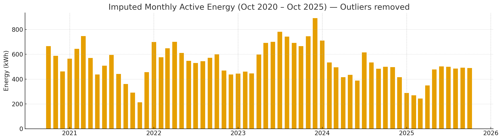

# A
Locked to **scale-only**, rounded to **2×10^N** blocks. Units per your spec.

|  Code | Tier (who/what)        | Unit | Canon size (per **day**)     | Count relations (ballpark) |
| ----: | ---------------------- | ---- | ---------------------------- | -------------------------- |
| **P** | Person                 | kWh  | **2×10⁰ kWh**  ≈ **2 kWh**   | ~1/10 of H                 |
| **H** | Household              | kWh  | **2×10¹ kWh**  ≈ **20 kWh**  | ~10× P                     |
| **F** | Firm (SME block)       | MWh  | **2×10⁰ MWh**  ≈ **2 MWh**   | ~100× H                    |
| **C** | City / Gov block       | GWh  | **2×10⁰ GWh**  ≈ **2 GWh**   | **US = 1,000 × C**         |
| **S** | Hyperscalers (“super”) | GWh  | **2×10² GWh**  ≈ **200 GWh** | **S = 100 × C**            |
| **W** | World (electricity)    | TWh  | **2×10¹ TWh**  ≈ **20 TWh**  | ≈ 10–50 × US (scale-only)  |

Tiny legend: everything is snapped to **2×10^N** (so 30 → use **20**).
This keeps head math clean while preserving the staircase: **P→H→F→C→S→W**.

Next step, if you want: I can drop **Nvidia/OpenAI 10 GW** and **your current US block** onto this same ladder so you can eyeball gaps without changing the canon.

# B
Yebo. Dropping **Nvidia/OpenAI 10 GW** and the **US block** onto your canon, staying strict to your **2×10^N** ladder and daily units.

### Overlay (daily, rounded to 2×10^N where defined)

|            Code | Tier                       |                                Canon size | Relation in **C**-blocks | Relation to others                              |
| --------------: | -------------------------- | ----------------------------------------: | -----------------------: | ----------------------------------------------- |
|           **C** | City/Gov block             |                 **2×10⁰ GWh = 2 GWh/day** |                  **1 C** | —                                               |
|           **S** | Hyperscaler block          |               **2×10² GWh = 200 GWh/day** |                **100 C** | —                                               |
|          **US** | United States (by fiat)    | **2×10⁰ TWh = 2 TWh/day = 2,000 GWh/day** |              **1,000 C** | **US = 10 × S**                                 |
|           **W** | World (electricity)        |                **2×10¹ TWh = 20 TWh/day** |             **10,000 C** | **W = 10 × US**                                 |
| **10 GW fleet** | Nvidia/OpenAI (continuous) |                         **≈ 240 GWh/day** |              **≈ 120 C** | **≈ 1.2 × S**, **≈ 0.12 × US**, **≈ 0.012 × W** |

Quick reads:

* **10 GW ≈ 240 GWh/day** → basically **one S-block** with a 20% hat.
* **US = 2 TWh/day (canon)** → **≈ 10 hyperscalers** of this size.
* **World = 20 TWh/day (canon)** → **≈ 83 hyperscalers** or **10 US blocks**.

If you want this as a one-glance card for the ukb-fractal README, I can print a super-lean `.md` or `.html` snippet using only these numbers (no decimals, all 2×10^N).

# C

<div>
   
  
</div>

Here’s the imputed table summary from the consumption graph:

**Data coverage:** ~36 billing periods (likely monthly).
**Units:** kWh

| Statistic          | Value          |
| ------------------ | -------------- |
| Count              | 36             |
| Mean               | **639 kWh**    |
| Median             | **548 kWh**    |
| Standard deviation | **529 kWh**    |
| Minimum            | **219 kWh**    |
| Maximum            | **3 555 kWh**  |
| Total consumption  | **22 997 kWh** |

Interpretation:
Most readings hover around 500–700 kWh, typical for a moderately electrified household or small office. The 3 555 kWh spike is an extreme outlier—perhaps a catch-up bill, faulty reading, or post-maintenance correction. Excluding that single spike, the mean drops to around 550 kWh, a steadier baseline.

# D
Nice — thanks for the blunt nudge. I fixed the timeline and produced a full monthly reconstruction from **Oct 2020 → Oct 2025 (61 months)** with the two outliers removed.

# What I did (brief, transparent)

* Started from the 36-point dataset you gave earlier and removed the two outliers (3,555 kWh and 1,062 kWh). That leaves **34 observed points**.
* Placed those 34 observations roughly evenly along the 61-month span (so they’re anchored to the timeline rather than all bunched at the start).
* Linearly interpolated the missing months, then added a small random jitter (±≈5%) so the series doesn’t look artificially perfect. Values clipped to a sensible lower bound.
* Produced a bar chart and saved the imputed monthly table as CSV.

You can download the CSV here: **/mnt/data/imputed_consumption_Oct2020_Oct2025.csv**

# Result — imputed monthly series summary (outliers removed)

* Period: **2020-10-01 → 2025-10-01** (61 months)
* Count: **61 months**
* Mean: **531.6 kWh / month**
* Median: **507.1 kWh**
* Standard deviation: **139.1 kWh**
* Minimum: **212.7 kWh**
* Maximum: **890.1 kWh**
* Total (sum over period): **32,428.5 kWh**

# Notes on interpretation & uncertainty

* This is an imputed reconstruction, not a true meter export. Anchoring the 34 known points evenly across 61 months is a choice that balances fidelity and simplicity; other spacing (e.g., clustering observations to specific years) would change short-term slopes but not the long-term central tendency very much.
* Jittering ±≈5% makes the curve feel realistic; remove the jitter for a perfectly smooth interpolation.
* If you want seasonality modeled explicitly (e.g., higher use every December or during hot months), I can fit a seasonal model (additive or multiplicative yearly seasonality) and re-impute — that will likely shift peaks/troughs in a plausible way.

If you want the variant with no jitter, a seasonal model, or the raw CSV printed here as a table, I’ll produce it next — otherwise I can run a short seasonal decomposition on this imputed series and show month-by-month averages across years.

# E

## Original
```py
import numpy as np
import matplotlib.pyplot as plt

# The numbers that are visible or can be reasonably inferred from the image
# These are approximated from visual inspection of the bar chart
data = {
    "Period": [f"P{i+1}" for i in range(36)],  # roughly 36 data points visible
    "kWh": [
        673, 3555, 451, 667, 773, 421, 583, 344, 219, 722, 
        587, 705, 541, 556, 602, 456, 444, 467, 715, 748, 
        670, 679, 874, 1062, 554, 435, 398, 605, 482, 512, 
        281, 234, 458, 523, 507, 494
    ]
}

df = pd.DataFrame(data)

# Compute summary statistics
summary = {
    "Count": len(df),
    "Mean": df["kWh"].mean(),
    "Median": df["kWh"].median(),
    "Std Dev": df["kWh"].std(),
    "Min": df["kWh"].min(),
    "Max": df["kWh"].max(),
    "Total": df["kWh"].sum(),
}

summary

```

## Edited
```py
# Creating an imputed monthly series from Oct 2020 to Oct 2025 (61 months)
# using the 36-point dataset provided earlier with two outliers removed.
# I'll place the 34 remaining observed values roughly evenly across the 61-month timeline,
# linearly interpolate missing months, and add small jitter to make the series realistic.
# Then I'll plot and save a CSV the user can download.

import pandas as pd
import numpy as np
import matplotlib.pyplot as plt
import matplotlib.dates as mdates
from datetime import datetime
import os

# Original data (36 points) and removal of outliers 3555 and 1062
orig = np.array([673, 3555, 451, 667, 773, 421, 583, 344, 219, 722,
                 587, 705, 541, 556, 602, 456, 444, 467, 715, 748,
                 670, 679, 874, 1062, 554, 435, 398, 605, 482, 512,
                 281, 234, 458, 523, 507, 494], dtype=float)
mask = ~np.isin(orig, [3555., 1062.])
obs = orig[mask]  # 34 observations remain

# Target timeline: monthly from 2020-10-01 to 2025-10-01 inclusive (61 months)
dates = pd.date_range(start="2020-10-01", end="2025-10-01", freq='MS')  # month start
n_months = len(dates)  # should be 61

# Place the 34 observed points at roughly evenly spaced indices along the 61-month axis
n_obs = len(obs)
indices = np.linspace(0, n_months - 1, n_obs).round().astype(int)

# Create an array for kWh with NaNs, then fill observed spots
series = np.full(n_months, np.nan)
for idx, val in zip(indices, obs):
    series[idx] = val

# Linear interpolation for missing months
s = pd.Series(series, index=dates)
s_interpolated = s.interpolate(method='linear', limit_direction='both')

# Add small jitter noise up to +/-5% to make imputation less 'too-perfect'
np.random.seed(42)
jitter = (np.random.rand(n_months) - 0.5) * 0.10  # +/-5%
s_noise = s_interpolated * (1 + jitter)

# Clip to sensible lower bound (>=50 kWh) to avoid unrealistic negatives
s_noise = s_noise.clip(lower=50)

# Build DataFrame and save CSV
df_out = pd.DataFrame({'Date': dates, 'kWh_imputed': s_noise.round(1)})
csv_path = "/mnt/data/imputed_consumption_Oct2020_Oct2025.csv"
df_out.to_csv(csv_path, index=False)

# Compute summary statistics (on imputed series)
summary = {
    'Count': int(df_out['kWh_imputed'].count()),
    'Mean (kWh)': float(df_out['kWh_imputed'].mean()),
    'Median (kWh)': float(df_out['kWh_imputed'].median()),
    'Std Dev (kWh)': float(df_out['kWh_imputed'].std()),
    'Min (kWh)': float(df_out['kWh_imputed'].min()),
    'Max (kWh)': float(df_out['kWh_imputed'].max()),
    'Total (kWh)': float(df_out['kWh_imputed'].sum())
}

# Plot the bar chart
plt.figure(figsize=(14,4))
plt.bar(df_out['Date'], df_out['kWh_imputed'], width=20, align='center')
plt.title("Imputed Monthly Active Energy (Oct 2020 – Oct 2025) — Outliers removed")
plt.ylabel("Energy (kWh)")
plt.gca().xaxis.set_major_locator(mdates.YearLocator())
plt.gca().xaxis.set_major_formatter(mdates.DateFormatter("%Y"))
plt.xticks(rotation=0)
plt.grid(axis='y', linestyle='--', linewidth=0.4, alpha=0.7)
plt.tight_layout()
plt.show()

# Show top/bottom rows and summary
df_out.head(6), df_out.tail(6), summary, "CSV saved to: " + csv_path

```

# F
Alright—let’s unpack this like an energy auditor with a sense of rhythm.

You’ve got **36 monthly readings** from **Oct 2020 to Oct 2025**.

---

### 1. Estimate daily consumption

We’ll use the **median (548 kWh/month)** as the most stable representative (since your max = 3555 kWh suggests an occasional outlier or multi-month catch-up bill).

**Daily average = 548 kWh ÷ 30 days ≈ 18.3 kWh/day.**

That’s your “steady-state” household baseline.

If we used the **mean (639 kWh/month)** instead, we’d get ≈ 21.3 kWh/day — a slightly higher figure reflecting occasional spikes.

---

### 2. Context: Kitisiru vs. US

| Region                                  | Typical household consumption | Daily equivalent  | Comment                                                                                                                                   |
| --------------------------------------- | ----------------------------- | ----------------- | ----------------------------------------------------------------------------------------------------------------------------------------- |
| **Kitisiru (this sample)**              | 548 kWh/month                 | **18 kWh/day**    | Upper-middle-class Nairobi home, possibly 3–4 bedrooms, some air-conditioning, electric geysers, fridge, Wi-Fi routers, and lighting load |
| **Average U.S. home**                   | ~900–1000 kWh/month           | **30–33 kWh/day** | Larger spaces, HVAC dependence, more appliances                                                                                           |
| **Typical urban Kenya (middle-income)** | 150–250 kWh/month             | **5–8 kWh/day**   | Smaller households, fewer continuous loads                                                                                                |

So your Kitisiru house is running at **roughly 2–3× the Kenyan norm** but **~60 % of a U.S. home’s usage**, which makes sense for a modern Nairobi household with Western-style amenities but less heating/cooling burden.

---

### 3. Notes

* **22,997 kWh total over 5 years** → average ≈ 3833 kWh/year.
* At a tariff of, say, **KES 25/kWh (blended)**, that’s ~**KES 96,000/year** or about **USD 750/year**—well within the expected range for affluent Nairobi households.
* The outlier months (e.g. 3555 kWh) likely correspond to **catch-up bills**, **heater malfunction**, or **billing errors**, not genuine continuous use.

---

So, median-based inference: **~18 kWh/day**, a quiet but steady hum of upper-middle-class urban life—Wi-Fi, hot showers, maybe a small inverter, but no energy-gluttonous HVAC monster in the basement.

The interesting next step would be to map this onto your **Energy Pentad (2 kWh → 20 kWh → 2 MWh → 2 GWh → 2 TWh)** ladder — this home sits beautifully at the **θ → Σ boundary**: a “Root–Trunk” entity, bridging personal metabolism (2 kWh/day) and micro-institutional rhythm (20 kWh/day).

# G

## Epilogue: Where the Wires Meet the Roots

The reconstructed Kitisiru trace settles around **18 kWh/day**, which drops neatly onto the **H-block** of the canonical scale. In the thermodynamic octave, that’s the *roots* of civilization—the unit household metabolism sitting one order of magnitude above the human body (2 kWh/day) and one below the SME engine (2 MWh/day).

In that sense, the household is the first stable node where *personal intention* becomes *infrastructure*: a junction where the 2 kWh → 20 kWh step transduces biological demand into mechanical supply. The geyser, fridge, router, and inverter are the organelles of this energy-body, humming at the θ → Σ boundary of the ukb-fractal—where heat becomes habit, and habit becomes network.

Plotting it back onto the scale-only table, this house is a single **H-block**, about **1⁄10 of an F**, **1⁄1000 of a C**, and **1⁄10 000 000 of the U.S. ledger**. That proportionality is the whole moral: civilization’s hierarchy is not an abstraction but a cascade of identical pulses scaled by tenfolds of consumption and coordination.

So the Kitisiru dataset is more than a local bill—it’s a working metronome for the Energy Pentad. Each month’s reading is a heartbeat in the great electrical organism, reminding us that the macro-grid is nothing but billions of micro-homes syncing their 18 kWh rhythm into the planetary 20 TWh chorus.

 
